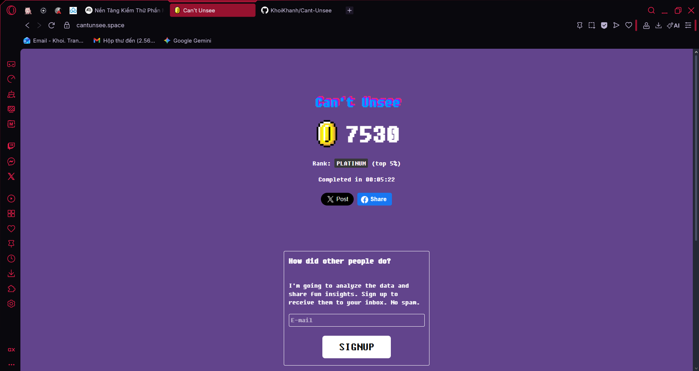

# Báo cáo môn học kiểm thử phần mềm

## Chương 1 - Kiểm thử giao diện - Can't Unsee

### Ngày thực hiện 05/01/2026 - thời gian 14:06

1. Đường dẫn: [Can't Unsee](https://cantunsee.space)
2. Mục đích: ghi nhận lại kết quả số bài làm
3. Số lần thực hiện: 1
4. Điểm số đạt được: 7530



## Chương 2: Kiểm thử đơn vị với JUnit (Student Analyzer)

### 2.1 Giới thiệu bài toán

Xây dựng và kiểm thử module `StudentAnalyzer` để xử lý dữ liệu điểm số học sinh. Hệ thống cần đảm bảo tính đúng đắn khi xử lý các dữ liệu đầu vào khác nhau, bao gồm cả dữ liệu lỗi.

**Chức năng chính:**

1. **`countExcellentStudents(List<Double> scores)`**: Đếm số lượng học sinh đạt loại Giỏi (điểm từ 8.0 trở lên).
2. **`calculateValidAverage(List<Double> scores)`**: Tính điểm trung bình cộng, tự động loại bỏ các điểm số không hợp lệ (điểm âm hoặc > 10).

### 2.2 Cấu trúc dự án

```text
KiemThuPhanMem/
├── unit-test/
│   ├── src/
│   │   └── StudentAnalyzer.java      # Mã nguồn logic xử lý
│   └── test/
│       └── StudentAnalyzerTest.java  # Kịch bản kiểm thử (JUnit 5)
```

### 2.3 Chiến lược kiểm thử (Test Strategy)

Các kịch bản kiểm thử (Test Cases) được thiết kế bao phủ các trường hợp:

**A. Phương thức `countExcellentStudents`**

* ✅ **Normal Case:** Danh sách chứa điểm giỏi, khá, trung bình.
* ✅ **Boundary Case:** Điểm ngay tại ngưỡng 8.0, 7.9, 10.0, 0.0.
* ✅ **Review Error/Invalid:** Điểm âm, điểm > 10, danh sách chứa `null`.
* ✅ **Empty/Null:** Danh sách rỗng hoặc đối tượng list là null.

**B. Phương thức `calculateValidAverage`**

* ✅ **Calculation:** Tính toán chính xác trung bình cộng các số hợp lệ.
* ✅ **Filter Logic:** Bỏ qua điểm sai, chỉ tính điểm đúng.
* ✅ **Edge Case:** Danh sách chỉ toàn điểm sai (trả về 0.0).

### 2.4 Hướng dẫn chạy kiểm thử

**Yêu cầu:** JDK 8+ và thư viện JUnit 5.

**Các bước thực hiện:**

1. Mở dự án bằng IDE (IntelliJ IDEA, Eclipse, hoặc VS Code).
2. Đảm bảo thư viện **JUnit 5.8.1** (hoặc mới hơn) đã được thêm vào classpath.
3. Mở file `unit-test/test/StudentAnalyzerTest.java`.
4. Nhấp chuột phải và chọn **Run 'StudentAnalyzerTest'**.
5. Kiểm tra kết quả trên thanh trạng thái (Green Bar = All Passed).
